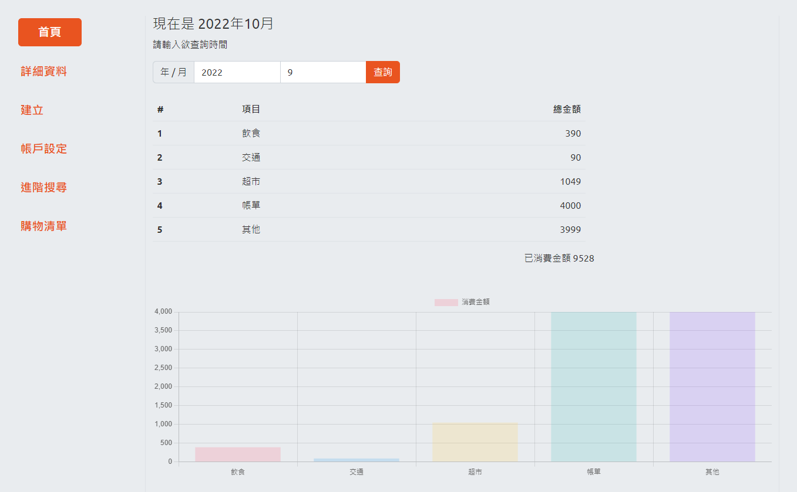
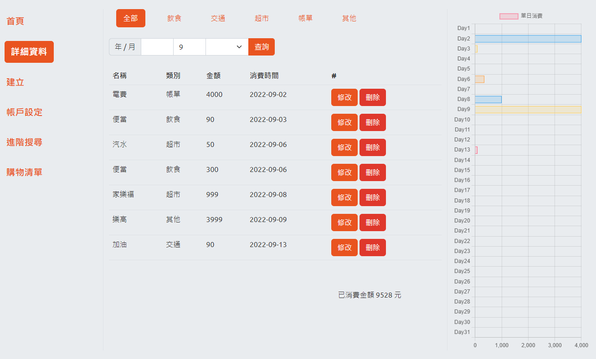

# Account Book (記帳本)
***


## __介紹__
是一個使用Express及MySQL打造的網頁記帳本，使用者需註冊之後才能使用，可以做基本的紀錄與搜尋。

<br>
<br>

## __功能簡介__ 

* 紀錄消費功能
* 將記錄視覺化
* 以時間或關鍵字搜尋過去的紀錄
* 能管理自己的帳號密碼
* 具備備忘錄清單
* 具備後台功能

## __專案安裝步驟__

1. 在本地端建立資料夾
```bash
打開終端機 ex. Git Bash 或 命令提示字元
mkdir account_book
cd account_book
```
2. 下載專案
```bash
git clone https://github.com/softtoday72/account_book.git
```
3. 安裝 npm 
```bash
npm install
```
4. 使用 MySQL Workbench 創建資料庫
```
create database account_book
```
5. 建立 migration
```bash
npx sequelize db:migrate
```
6. 建立種子資料
```bash
npx sequelize db:seed:all
```
7. 啟動伺服器執行檔案
```bash
npm run start
```
8. 出現以下訊息表示順利運行
```bash
App is running on http://localhost:3000
```

## __測試帳號__
* 管理員帳號: root  密碼: 1234 
* 使用者帳號: root1 密碼: 1234

## __開發工具__

* bcryptjs 2.4.3
* connect-flash 0.1.1
* dayjs 1.10.6
* express 4.17.1
* express-handlebars 4.0.4
* express-session 1.17.1
* method-override 3.0.0
* mysql2 2.1.0
* passport 0.4.1
* passport-local 1.0.0
* sequelize 5.21.13
* sequelize-cli 5.5.1